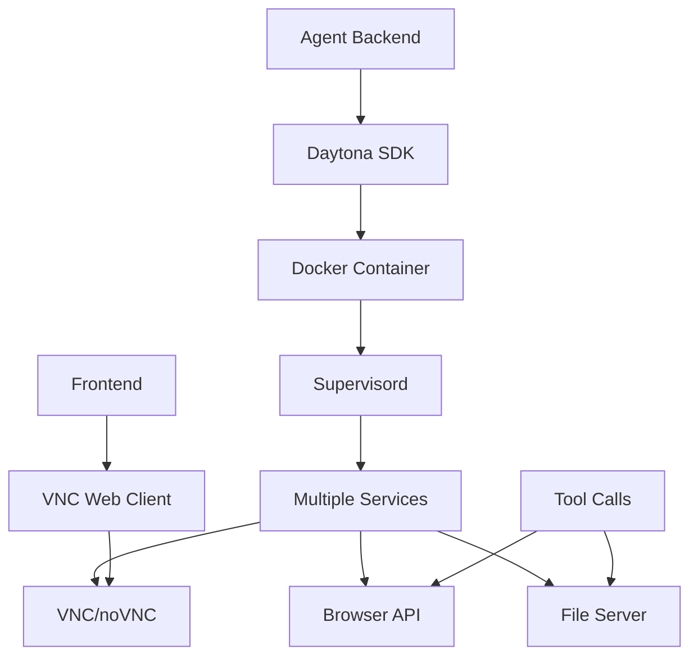

# Suna Sandbox 实现原理分析与全本地化方案

## 1. Suna Sandbox 架构分析

### 1.1 整体架构概述

Suna的Sandbox是一个基于Docker容器化的虚拟环境，为AI Agent提供隔离的执行环境。其核心架构包括：

- **容器化环境**: 基于Python 3.11-slim的Docker容器
- **服务编排**: 使用Supervisord管理多个服务进程
- **远程访问**: 通过VNC和noVNC提供图形界面访问
- **API接口**: 提供文件操作、浏览器控制等RESTful API
- **云端管理**: 通过Daytona SDK进行容器生命周期管理

### 1.2 核心组件分析

#### 1.2.1 容器基础环境 (Dockerfile)

```dockerfile
# 基础镜像: Python 3.11-slim
FROM python:3.11-slim

# 系统依赖包括:
# - 浏览器相关: chromium, xvfb, x11vnc
# - 开发工具: git, nodejs, npm, vim
# - 文档处理: poppler-utils, tesseract-ocr
# - 网络工具: curl, wget, netcat
```

**关键特性:**
- 完整的Linux环境，包含常用开发工具
- Playwright + Chromium 浏览器自动化
- VNC服务器支持图形界面访问
- OCR和文档处理能力
- Node.js环境支持前端开发

#### 1.2.2 服务管理 (Supervisord)

```ini
[supervisord]
user=root
nodaemon=true

# 服务启动顺序:
# 1. xvfb (虚拟显示服务器) - priority=100
# 2. vnc_setup (VNC密码设置) - priority=150  
# 3. x11vnc (VNC服务器) - priority=200
# 4. novnc (Web VNC客户端) - priority=300
# 5. http_server (静态文件服务) - priority=400
# 6. browser_api (浏览器API服务) - priority=400
```

**服务依赖关系:**
- xvfb → vnc_setup → x11vnc → novnc
- 所有服务并行启动，通过priority控制顺序

#### 1.2.3 API服务层

**文件操作API (api.py):**
```python
# 主要功能:
- 文件上传/下载
- 目录列表
- 文件权限管理
- 路径规范化处理
- 用户权限验证
```

**浏览器控制API (browser_api.py):**
```python
# 核心功能:
- Playwright浏览器自动化
- DOM元素识别和交互
- 页面截图和OCR
- 多标签页管理
- 拖拽操作支持
```

**静态文件服务 (server.py):**
```python
# 功能:
- 服务/workspace目录下的静态文件
- 自动创建工作目录
- 支持HTML文件直接访问
```

#### 1.2.4 云端管理层 (sandbox.py)

```python
# Daytona SDK集成:
- 容器创建和销毁
- 容器状态管理 (启动/停止/归档)
- 资源配置 (CPU/内存/磁盘)
- 环境变量注入
- 会话管理
```

### 1.3 网络端口分配

| 端口 | 服务 | 用途 |
|------|------|------|
| 5901 | x11vnc | VNC服务器 |
| 6080 | noVNC | Web VNC客户端 |
| 7788 | browser_api | 浏览器控制API |
| 8000 | - | 预留端口 |
| 8080 | http_server | 静态文件服务 |
| 9222 | Chrome | 远程调试端口 |

### 1.4 数据流分析



## 2. 全本地化实现方案设计

### 2.1 设计目标

- **完全本地化**: 移除对Daytona云服务的依赖
- **轻量化部署**: 简化容器管理和部署流程
- **保持兼容**: 维持现有API接口的兼容性
- **增强安全**: 提供更好的本地安全控制

### 2.2 架构重设计

#### 2.2.1 本地容器管理器

```python
# local_sandbox_manager.py
class LocalSandboxManager:
    """
    本地沙箱管理器，替代Daytona SDK
    """
    
    def __init__(self, docker_client):
        self.docker = docker_client
        self.containers = {}  # 容器实例缓存
        self.base_image = "local-suna-sandbox:latest"
    
    async def create_sandbox(self, project_id: str, config: dict) -> str:
        """
        创建新的沙箱容器
        """
        container_name = f"suna-sandbox-{project_id}"
        
        # 容器配置
        container_config = {
            'image': self.base_image,
            'name': container_name,
            'ports': {
                '5901/tcp': None,  # VNC
                '6080/tcp': None,  # noVNC
                '7788/tcp': None,  # Browser API
                '8080/tcp': None,  # File Server
            },
            'environment': {
                'VNC_PASSWORD': config.get('vnc_password', 'defaultpass'),
                'RESOLUTION': config.get('resolution', '1024x768x24'),
                'WORKSPACE_PATH': '/workspace',
            },
            'volumes': {
                f'suna-workspace-{project_id}': {'bind': '/workspace', 'mode': 'rw'}
            },
            'shm_size': '2g',
            'cap_add': ['SYS_ADMIN'],
            'security_opt': ['seccomp=unconfined'],
            'restart_policy': {'Name': 'unless-stopped'}
        }
        
        container = self.docker.containers.run(**container_config, detach=True)
        self.containers[project_id] = container
        
        # 等待服务启动
        await self._wait_for_services(container)
        
        return container.id
    
    async def get_sandbox(self, project_id: str) -> dict:
        """
        获取沙箱信息
        """
        if project_id in self.containers:
            container = self.containers[project_id]
            container.reload()
            
            return {
                'id': container.id,
                'name': container.name,
                'status': container.status,
                'ports': self._get_container_ports(container),
                'created': container.attrs['Created']
            }
        
        # 尝试从Docker中查找现有容器
        try:
            container = self.docker.containers.get(f"suna-sandbox-{project_id}")
            self.containers[project_id] = container
            return await self.get_sandbox(project_id)
        except:
            raise ValueError(f"Sandbox for project {project_id} not found")
    
    async def start_sandbox(self, project_id: str):
        """
        启动沙箱
        """
        sandbox_info = await self.get_sandbox(project_id)
        container = self.containers[project_id]
        
        if container.status != 'running':
            container.start()
            await self._wait_for_services(container)
    
    async def stop_sandbox(self, project_id: str):
        """
        停止沙箱
        """
        if project_id in self.containers:
            container = self.containers[project_id]
            container.stop()
    
    async def delete_sandbox(self, project_id: str):
        """
        删除沙箱
        """
        if project_id in self.containers:
            container = self.containers[project_id]
            container.stop()
            container.remove()
            
            # 删除数据卷
            try:
                volume = self.docker.volumes.get(f'suna-workspace-{project_id}')
                volume.remove()
            except:
                pass
            
            del self.containers[project_id]
    
    def _get_container_ports(self, container) -> dict:
        """
        获取容器端口映射
        """
        ports = {}
        port_bindings = container.attrs['NetworkSettings']['Ports']
        
        for internal_port, bindings in port_bindings.items():
            if bindings:
                external_port = bindings[0]['HostPort']
                service_name = {
                    '5901/tcp': 'vnc',
                    '6080/tcp': 'novnc', 
                    '7788/tcp': 'browser_api',
                    '8080/tcp': 'file_server'
                }.get(internal_port, 'unknown')
                
                ports[service_name] = {
                    'internal': internal_port.split('/')[0],
                    'external': external_port,
                    'url': f"http://localhost:{external_port}"
                }
        
        return ports
    
    async def _wait_for_services(self, container, timeout=60):
        """
        等待容器内服务启动完成
        """
        import time
        start_time = time.time()
        
        while time.time() - start_time < timeout:
            try:
                # 检查VNC端口是否可用
                result = container.exec_run("nc -z localhost 5901")
                if result.exit_code == 0:
                    break
            except:
                pass
            
            await asyncio.sleep(2)
        
        # 额外等待其他服务启动
        await asyncio.sleep(5)
```

#### 2.2.2 本地API适配器

```python
# local_sandbox_api.py
class LocalSandboxAPI:
    """
    本地沙箱API适配器，提供与原有API兼容的接口
    """
    
    def __init__(self, sandbox_manager: LocalSandboxManager):
        self.manager = sandbox_manager
    
    async def execute_command(self, project_id: str, command: str) -> dict:
        """
        在沙箱中执行命令
        """
        sandbox_info = await self.manager.get_sandbox(project_id)
        container = self.manager.containers[project_id]
        
        result = container.exec_run(
            command,
            workdir='/workspace',
            environment={'DISPLAY': ':99'}
        )
        
        return {
            'exit_code': result.exit_code,
            'output': result.output.decode('utf-8', errors='ignore'),
            'command': command
        }
    
    async def upload_file(self, project_id: str, file_path: str, content: bytes):
        """
        上传文件到沙箱
        """
        import tarfile
        import io
        
        sandbox_info = await self.manager.get_sandbox(project_id)
        container = self.manager.containers[project_id]
        
        # 创建tar文件
        tar_stream = io.BytesIO()
        with tarfile.open(fileobj=tar_stream, mode='w') as tar:
            tarinfo = tarfile.TarInfo(name=os.path.basename(file_path))
            tarinfo.size = len(content)
            tar.addfile(tarinfo, io.BytesIO(content))
        
        tar_stream.seek(0)
        
        # 上传到容器
        container.put_archive(
            path=os.path.dirname(f'/workspace/{file_path}'),
            data=tar_stream.getvalue()
        )
    
    async def download_file(self, project_id: str, file_path: str) -> bytes:
        """
        从沙箱下载文件
        """
        import tarfile
        
        sandbox_info = await self.manager.get_sandbox(project_id)
        container = self.manager.containers[project_id]
        
        # 从容器获取文件
        archive, _ = container.get_archive(f'/workspace/{file_path}')
        
        # 解压tar文件
        tar_stream = io.BytesIO(b''.join(archive))
        with tarfile.open(fileobj=tar_stream, mode='r') as tar:
            file_member = tar.next()
            if file_member:
                return tar.extractfile(file_member).read()
        
        raise FileNotFoundError(f"File {file_path} not found")
    
    async def list_files(self, project_id: str, directory: str = '/') -> list:
        """
        列出目录文件
        """
        command = f"find /workspace{directory} -maxdepth 1 -exec ls -la {{}} \;"
        result = await self.execute_command(project_id, command)
        
        # 解析ls输出
        files = []
        for line in result['output'].split('\n'):
            if line.strip() and not line.startswith('total'):
                parts = line.split()
                if len(parts) >= 9:
                    files.append({
                        'name': parts[-1],
                        'permissions': parts[0],
                        'size': parts[4],
                        'modified': ' '.join(parts[5:8]),
                        'is_directory': parts[0].startswith('d')
                    })
        
        return files
```

#### 2.2.3 Docker Compose配置优化

```yaml
# docker-compose.local.yml
version: '3.8'

services:
  suna-sandbox-base:
    build:
      context: ./sandbox/docker
      dockerfile: Dockerfile.local
    image: local-suna-sandbox:latest
    profiles: ["build-only"]

  suna-backend:
    build:
      context: .
      dockerfile: Dockerfile
    ports:
      - "8000:8000"
    environment:
      - SANDBOX_MODE=local
      - DOCKER_HOST=unix:///var/run/docker.sock
    volumes:
      - /var/run/docker.sock:/var/run/docker.sock
      - ./data:/app/data
    depends_on:
      - postgres
      - redis

  postgres:
    image: postgres:15
    environment:
      POSTGRES_DB: suna
      POSTGRES_USER: suna
      POSTGRES_PASSWORD: suna_password
    volumes:
      - postgres_data:/var/lib/postgresql/data
    ports:
      - "5432:5432"

  redis:
    image: redis:7-alpine
    ports:
      - "6379:6379"
    volumes:
      - redis_data:/data

volumes:
  postgres_data:
  redis_data:
```

#### 2.2.4 本地化Dockerfile

```dockerfile
# Dockerfile.local
FROM python:3.11-slim

# 安装Docker CLI (用于容器管理)
RUN apt-get update && apt-get install -y \
    docker.io \
    && rm -rf /var/lib/apt/lists/*

# 其他依赖保持不变...
# (复用原有的系统依赖安装)

# 添加本地化组件
COPY local_sandbox_manager.py /app/
COPY local_sandbox_api.py /app/

# 修改启动脚本
COPY entrypoint.local.sh /app/
RUN chmod +x /app/entrypoint.local.sh

CMD ["/app/entrypoint.local.sh"]
```

### 2.3 部署方案

#### 2.3.1 一键部署脚本

```bash
#!/bin/bash
# deploy-local.sh

set -e

echo "🚀 开始部署Suna本地化版本..."

# 检查Docker环境
if ! command -v docker &> /dev/null; then
    echo "❌ Docker未安装，请先安装Docker"
    exit 1
fi

if ! command -v docker-compose &> /dev/null; then
    echo "❌ Docker Compose未安装，请先安装Docker Compose"
    exit 1
fi

# 构建基础镜像
echo "📦 构建沙箱基础镜像..."
docker-compose -f docker-compose.local.yml build suna-sandbox-base

# 启动服务
echo "🔧 启动服务..."
docker-compose -f docker-compose.local.yml up -d suna-backend postgres redis

# 等待服务启动
echo "⏳ 等待服务启动..."
sleep 10

# 检查服务状态
echo "🔍 检查服务状态..."
docker-compose -f docker-compose.local.yml ps

# 显示访问信息
echo "✅ 部署完成！"
echo "📱 前端访问地址: http://localhost:3000"
echo "🔧 后端API地址: http://localhost:8000"
echo "📊 数据库地址: localhost:5432"
echo "🗄️ Redis地址: localhost:6379"

echo ""
echo "📝 使用说明:"
echo "1. 访问前端界面创建项目"
echo "2. 系统将自动创建独立的沙箱容器"
echo "3. 每个项目拥有独立的工作空间和端口"
echo "4. 通过VNC可以访问图形界面 (端口会动态分配)"
```

#### 2.3.2 配置管理

```python
# config/local_config.py
class LocalConfig:
    """
    本地化配置管理
    """
    
    # Docker配置
    DOCKER_HOST = "unix:///var/run/docker.sock"
    SANDBOX_BASE_IMAGE = "local-suna-sandbox:latest"
    
    # 端口范围配置
    VNC_PORT_RANGE = (15901, 16000)  # VNC端口范围
    NOVNC_PORT_RANGE = (16080, 16179)  # noVNC端口范围
    API_PORT_RANGE = (17788, 17887)  # API端口范围
    HTTP_PORT_RANGE = (18080, 18179)  # HTTP端口范围
    
    # 资源限制
    DEFAULT_CPU_LIMIT = 2
    DEFAULT_MEMORY_LIMIT = "4g"
    DEFAULT_DISK_LIMIT = "10g"
    
    # 安全配置
    SANDBOX_NETWORK = "suna-sandbox-network"
    WORKSPACE_BASE_PATH = "/var/lib/suna/workspaces"
    
    # 清理配置
    AUTO_CLEANUP_INACTIVE_HOURS = 24
    MAX_CONCURRENT_SANDBOXES = 10
```

### 2.4 优势对比

| 特性 | 原版(Daytona) | 本地化版本 |
|------|---------------|------------|
| **部署复杂度** | 需要Daytona服务 | 仅需Docker |
| **网络依赖** | 需要外网连接 | 完全离线 |
| **数据安全** | 数据在云端 | 数据本地存储 |
| **成本** | 按使用付费 | 一次性部署 |
| **定制性** | 受限于云服务 | 完全可定制 |
| **性能** | 网络延迟 | 本地直连 |
| **扩展性** | 云端自动扩展 | 手动管理 |
| **维护成本** | 低 | 中等 |

### 2.5 迁移指南

#### 2.5.1 代码修改点

1. **替换sandbox.py中的Daytona SDK调用**
2. **修改tool_base.py中的沙箱获取逻辑**
3. **更新api.py中的权限验证机制**
4. **添加本地容器管理组件**

#### 2.5.2 数据迁移

```python
# migration/migrate_to_local.py
async def migrate_projects_to_local():
    """
    将现有项目迁移到本地化版本
    """
    # 1. 导出项目数据
    # 2. 创建本地沙箱
    # 3. 迁移工作空间文件
    # 4. 更新数据库记录
    pass
```

## 3. 总结

本地化方案通过替换Daytona SDK为本地Docker管理，实现了完全离线的沙箱环境。主要改进包括：

1. **移除云依赖**: 使用本地Docker API替代Daytona
2. **简化部署**: 一键部署脚本，降低使用门槛
3. **增强安全**: 数据完全本地化，提高安全性
4. **降低成本**: 无需云服务费用，适合个人和小团队
5. **保持兼容**: API接口保持兼容，最小化代码修改

该方案特别适合对数据安全要求高、网络环境受限或希望降低运营成本的场景。